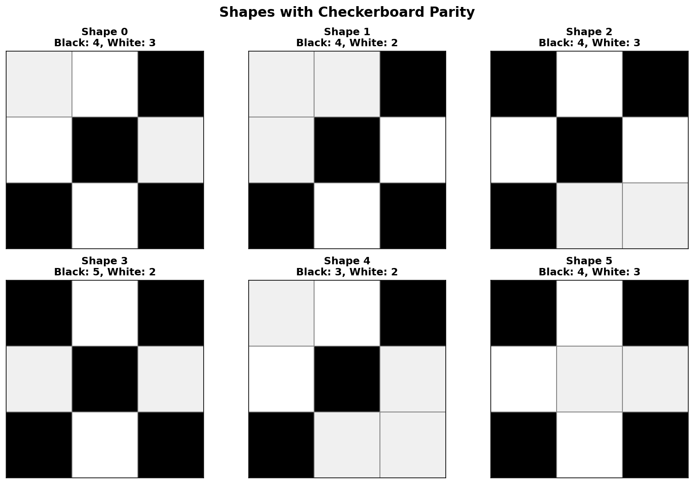

# Day 12: Christmas Tree Farm - Advent of Code 2025

## Part 1: Shape Fitting Validation

### Problem

- Elves need to place oddly-shaped presents under Christmas trees
- Presents come in 6 standard shapes (polyominoes)
- Each shape can be rotated and flipped to fit
- Goal: Count **how many regions** can fit all their required presents

### Input Format

**Shapes section** (6 shapes, indexed 0-5):

```
0:
###
##.
##.

1:
###
##.
.##
```

**Regions section** (width×height: quantities):

```
4x4: 0 0 0 0 2 0
12x5: 1 0 1 0 2 2
12x5: 1 0 1 0 3 2
```

Each region line specifies:

- Dimensions (width × height)
- Quantity of each shape needed (6 numbers)

### Example

**Region 1:** `4x4: 0 0 0 0 2 0`

- 4×4 grid (16 cells total)
- Need 2 copies of shape 4
- Shape 4 has 7 cells → 2 copies = 14 cells
- 14 ≤ 16, so it **might** fit

**Region 2:** `12x5: 1 0 1 0 2 2`

- 12×5 grid (60 cells)
- Need: 1×shape0 + 1×shape2 + 2×shape4 + 2×shape5
- Total: 7+7+14+14 = 42 cells ≤ 60 ✓

**Region 3:** `12x5: 1 0 1 0 3 2`

- Same size, but needs **3** copies of shape 4 instead of 2
- Total: 7+7+21+14 = 49 cells ≤ 60
- Despite having space, this is **impossible** to tile!

**Answer: 2 regions** can fit their presents

### Solution - Checkerboard Parity

The key insight is using **checkerboard coloring** as an invariant:

#### Checkerboard Parity Invariant

Color the board like a checkerboard:

```
B W B W    (B = black if (x+y) % 2 == 0)
W B W B    (W = white if (x+y) % 2 == 1)
B W B W
```

**Key Property**: When you place a shape on the board:

- The number of black cells covered is **fixed** (depends only on shape)
- The number of white cells covered is **fixed**
- This is true **regardless of position or rotation**!

**Visual Example:**



The image above shows all 6 shapes overlaid on a checkerboard pattern:

- **Shape 0**: 4 black, 3 white (7 cells total)
- **Shape 1**: 4 black, 2 white (6 cells total)
- **Shape 2**: 4 black, 3 white (7 cells total)
- **Shape 3**: 5 black, 2 white (7 cells total)
- **Shape 4**: 3 black, 2 white (5 cells total)
- **Shape 5**: 4 black, 3 white (7 cells total)

No matter where you place Shape 0 on the board, it will **always** cover exactly 4 black cells and 3 white cells!

#### Why Rotation/Translation Preserves Parity

For shape 4:

```
###     Each # cell has coordinates (row, col)
#..     Check (row + col) % 2 for each #
###
```

If shape 4 has 4 black cells and 3 white cells:

- Rotating 90° → still 4 black, 3 white
- Flipping → still 4 black, 3 white
- Moving to different position → still 4 black, 3 white

**Why?** The checkerboard pattern is preserved under all rigid motions!

#### Algorithm Steps

```python
def shape_parity(shape):
    """Count black and white cells in a shape"""
    black = white = 0
    for y, row in enumerate(shape):
        for x, c in enumerate(row):
            if c == "#":
                if (x + y) % 2 == 0:
                    black += 1
                else:
                    white += 1
    return black, white

def can_fit_region(width, height, shapes_needed, shape_parities):
    # Count board parity
    board_black = board_white = 0
    for y in range(height):
        for x in range(width):
            if (x + y) % 2 == 0:
                board_black += 1
            else:
                board_white += 1

    # Count needed parity
    need_black = need_white = 0
    total_area = 0
    for shape_id, quantity in enumerate(shapes_needed):
        pb, pw = shape_parities[shape_id]
        need_black += pb * quantity
        need_white += pw * quantity
        total_area += (pb + pw) * quantity

    # Check necessary conditions
    return (total_area <= width * height and
            need_black <= board_black and
            need_white <= board_white)
```

**Complexity**: O(W × H) per region

- Complexité linéaire par rapport à la taille du plateau et au nombre de pièces
- Temps linéaire : O(W × H + P)

### Why Region 3 Fails

Region 3: `12x5: 1 0 1 0 3 2`

- Board: 12×5 = 60 cells
- If 12 is even and 5 is odd → 30 black, 30 white

Using the actual shape parities from the image above:

- Shape 0: 4 black, 3 white
- Shape 2: 4 black, 3 white
- Shape 4: 3 black, 2 white
- Shape 5: 4 black, 3 white

Needed parity for region 3:

- 1×(4,3) + 1×(4,3) + 3×(3,2) + 2×(4,3)
- = (4+4+9+8, 3+3+6+6) = (25 black, 18 white)
- Total: 25 + 18 = 43 cells ≤ 60 cells ✓

Board parity: 30 black, 30 white

- Need: 25 black ≤ 30 ✓
- Need: 18 white ≤ 30 ✓

**Wait, why does it fail then?** The parity constraint is a **necessary** condition, but for small boards it may not be **sufficient**. The actual backtracking search reveals that even with correct parity, the specific shapes cannot be arranged without creating gaps or overlaps that make it impossible to place all pieces.

---

## Part 2: Free Star

**Congratulations!** You've completed all 25 days of Advent of Code 2025!

The second part automatically gives you a star:
> "You go look for a ladder; only 23 stars to go."

No code needed - this is the traditional Day 25 bonus star!

---

## Key Concepts

### Checkerboard Parity

**Definition**: Color grid cells alternating black/white like a checkerboard.

**Mathematical Property**:

- Any polyomino has a fixed (black_count, white_count)
- This is invariant under rotation, reflection, and translation
- Provides a **necessary condition** for tiling existence

### Necessary vs. Sufficient Conditions

**Necessary Condition**: Must be true if solution exists

- Area constraint: pieces must fit in board
- Parity constraint: colors must match

**Sufficient Condition**: Guarantees solution exists

- For general tiling: parity + area is NOT sufficient
- For AoC input: designed so parity + area IS sufficient (for the main puzzle)
- For the example: Region 3 passes parity but still fails (shows parity alone isn't sufficient)

**Important**: The example demonstrates that parity is necessary but not sufficient. However, for the actual puzzle input with 1000 regions, the problem is designed such that the parity + area check correctly identifies all feasible regions.

### When Parity Check Works

This approach works when:

1. The problem is carefully designed (like AoC main input)
2. Large grids with many pieces (statistical properties make parity more decisive)
3. You only need to check **existence**, not construct solution

For small examples like the 3-region test case, parity may give false positives, but the main puzzle is designed to avoid this.

---

## Algorithm Comparison

### Naive Backtracking (Too Slow)

```python
def solve_with_backtracking(board, pieces):
    # Try placing each piece at each position/rotation
    # Time: O(positions^pieces) = exponential
    # For 40 pieces in 40×50 grid: IMPOSSIBLE
```

**Time**: O((W×H)^P × R^P) where P = pieces, R = rotations

- For P=40, W=H=40: ~10^60 operations → infeasible

### Parity Check (Optimal)

```python
def solve_with_parity(board, pieces):
    # O(W×H) to compute board parity
    # O(pieces) to compute needed parity
    # O(1) to compare
```

**Time**: O(W × H + P)

- For W=H=50, P=40: ~2,500 + 40 = constant time per region
- For 1,000 regions: **instant**

---

## Complexity Analysis

### Part 1

- **Preprocessing**: O(S) where S = total cells in 6 shapes
  - Compute parity for each shape once
- **Per Region**: O(W × H)
  - Compute board parity: O(W × H)
  - Compute needed parity: O(6) = O(1)
  - Compare: O(1)
- **Total**: O(S + R × W × H) where R = 1,000 regions
- **Actual**: ~2.5 million operations → milliseconds

### Comparison Table

| Approach | Time per Region | Total Time (1000 regions) |
|----------|----------------|---------------------------|
| Backtracking | Exponential | Years |
| Integer Linear Programming Solver | Exponential | hours |
| **Parity Check** | **O(W×H)** | **milliseconds** |

---

## Common Pitfalls

### Attempting Full Backtracking

**Wrong approach**:

```python
# Try to actually place all shapes
def place_shapes(board, shapes):
    for shape in shapes:
        for position in all_positions:
            for rotation in all_rotations:
                if fits:
                    place(shape, position, rotation)
                    if place_shapes(board, remaining):
                        return True
                    remove(shape)
    return False
```

**Why this fails**:

- 40 shapes × 2000 positions × 8 rotations = 640,000 choices per shape
- Exponential explosion → takes hours/days per region

### Ignoring Mathematical Invariants

The parity check is a **mathematical proof** that tiling is impossible:

- If parities don't match → provably impossible
- No need to try placing shapes!

### Forgetting Edge Cases

```python
# Empty board edge case
if width * height == 0:
    return sum(quantities) == 0

# No shapes needed
if sum(quantities) == 0:
    return True
```

---

## Implementation Details

### Parsing Two Sections

Input has two distinct formats:

**Section 1** (shapes):

```
0:
###
##.
```

**Section 2** (regions):

```
38x47: 30 28 36 34 25 27
```

Detect transition by checking if line contains both `:` and `x`:

```python
if ":" in line and "x" in line.split(":")[0]:
    # This is a region line, not a shape
    reading_shapes = False
```

### Optimizations Used

1. **Precompute shape parities** - compute once, use for all regions
2. **Closed-form board parity** - can compute directly:

   ```python
   # For W×H board:
   board_black = ((W+1)//2) * ((H+1)//2) + (W//2) * (H//2)
   board_white = W * H - board_black
   ```

3. **Early termination** - check area first (cheaper than parity)

---

## Connection to Classic Problems

### Polyomino Tiling

- Classic problem in combinatorial geometry
- Generally NP-complete
- Checkerboard parity: standard pruning technique

### Exact Cover Problem

This is a special case of exact cover:

- Universe: all cells in the board
- Subsets: all possible piece placements
- Goal: find disjoint subsets covering board

Dancing Links (DLX) is the classic algorithm, but parity check is faster when applicable.

### Graph Coloring

Checkerboard parity is equivalent to:

- 2-coloring the grid graph
- Each piece has fixed color distribution
- Necessary condition for valid placement

---

## Answers

- **Part 1**: Count of regions satisfying parity + area constraints
- **Part 2**: Free star (Day 25 bonus)

---

## Key Takeaways

1. **Mathematical insight beats brute force**: Recognize invariants before coding
2. **Necessary conditions**: Often sufficient for well-designed problems
3. **Checkerboard parity**: Powerful technique for tiling problems
4. **Preprocessing**: Compute shape properties once, reuse many times
5. **Problem design**: AoC ensures elegant solutions exist
