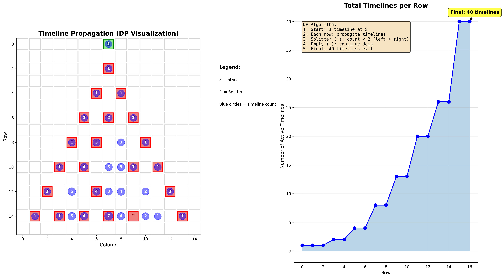
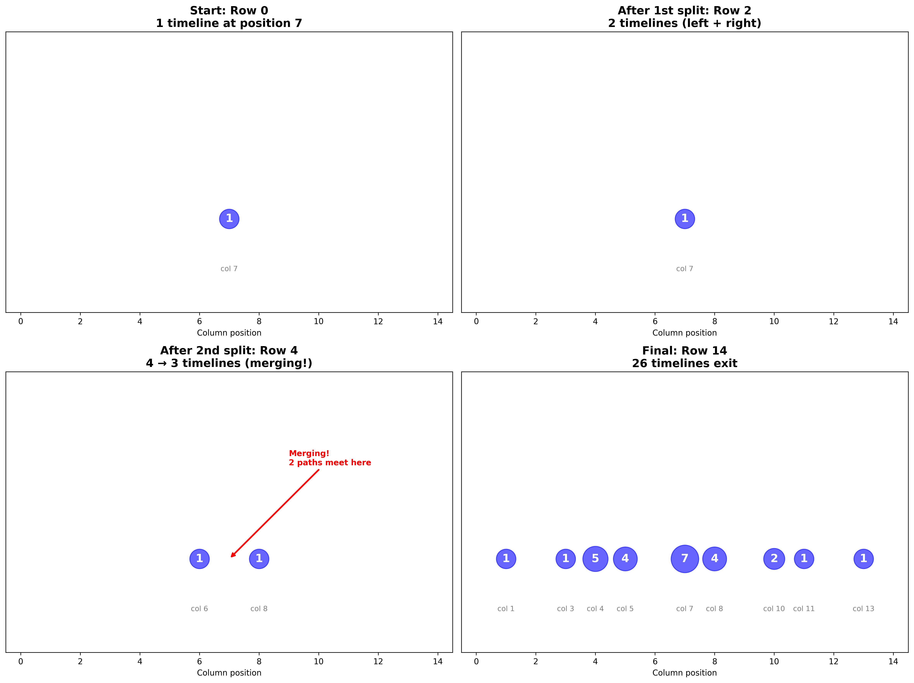

# Day 7: Laboratories - Advent of Code 2025

## Part 1: Tachyon Beam Splitting

### Problem

- A tachyon beam enters at position `S` and moves **downward**
- When a beam hits a splitter `^`, it stops and creates two new beams
- New beams start at positions **immediately left and right** of the splitter
- These new beams continue **downward** from the next row
- Count the total number of beam splits

### Example

```
.......S.......
...............
.......^.......    ← First split: beam hits splitter at row 2
...............
......^.^......    ← Two more splits (left and right beams each hit)
...............
.....^.^.^.....    ← Three more splits
...............
....^.^...^....    ← Three more splits
...............
...^.^...^.^...    ← Four more splits
...............
..^...^.....^..    ← Three more splits
...............
.^.^.^.^.^...^.    ← Five more splits
...............

Total: 21 splits
```

### Solution - BFS with Beam Tracking

Track beams as they propagate downward through the manifold:

```python
from collections import deque

def solve_part1(data):
    lines = data.strip().split('\n')
    grid = [list(line) for line in lines]
    rows, cols = len(grid), len(grid[0])

    # Find starting position S
    start_col = next(c for c in range(cols) if grid[0][c] == 'S')

    # Queue: (start_row, col) - beams moving downward
    queue = deque([(0, start_col)])
    visited_beams = set()
    visited_splits = set()
    split_count = 0

    while queue:
        start_row, col = queue.popleft()

        if (start_row, col) in visited_beams:
            continue
        visited_beams.add((start_row, col))

        # Move beam downward until it hits a splitter or exits
        for row in range(start_row, rows):
            if grid[row][col] == '^':
                # Count split only once per splitter position
                if (row, col) not in visited_splits:
                    visited_splits.add((row, col))
                    split_count += 1

                # Create two new beams from next row
                if col - 1 >= 0:
                    queue.append((row + 1, col - 1))
                if col + 1 < cols:
                    queue.append((row + 1, col + 1))
                break

    return split_count
```

**Key insight**: Track `(start_row, col)` to avoid processing duplicate beams, and track `(row, col)` of splitters to count each split only once.

---

## Part 2: Quantum Tachyon Timeline Counting

### Problem

- A **single quantum particle** enters at `S`
- At each splitter, the particle takes **both paths** (quantum superposition)
- This creates parallel **timelines** (many-worlds interpretation)
- Count the total number of distinct timelines after the particle completes all journeys

### Example Timelines

```
Timeline 1 - Always go left:
.......S.......
.......|.......
......|^.......
......|........
.....|^.^......
Total: 40 distinct timelines
```

Each splitter doubles the number of timelines, but timelines can **merge** when they reach the same position at the same row.

### Solution - Dynamic Programming

Instead of tracking individual paths (exponential), count timelines per position:

```python
def solve_part2(data):
    lines = data.strip().split('\n')
    grid = [list(line) for line in lines]
    rows, cols = len(grid), len(grid[0])

    # Find starting position
    start_col = next(c for c in range(cols) if grid[0][c] == 'S')

    # dp[col] = number of timelines at this column in current row
    current_row_counts = {start_col: 1}

    for row in range(rows):
        next_row_counts = {}

        for col, count in current_row_counts.items():
            if grid[row][col] == '^':
                # Split: each timeline becomes two
                if col - 1 >= 0:
                    next_row_counts[col - 1] = next_row_counts.get(col - 1, 0) + count
                if col + 1 < cols:
                    next_row_counts[col + 1] = next_row_counts.get(col + 1, 0) + count
            else:
                # Continue downward
                next_row_counts[col] = next_row_counts.get(col, 0) + count

        current_row_counts = next_row_counts

    return sum(current_row_counts.values())
```

### Why DP Works

**Naïve approach** (exponential):
- Track full path: `(row, col, (split1_choice, split2_choice, ...))`
- Memory: O(2^n) where n = number of splitters
- Time: O(2^n × rows)

**DP approach** (linear):
- Only track: `(row, col) → timeline_count`
- Memory: O(rows × cols)
- Time: O(rows × cols)

**Key insight**: Timelines that reach the same `(row, col)` are **indistinguishable** going forward, so we can merge their counts.

### Timeline Merging Example

```
Row 0: Position 7 has 1 timeline
Row 2: After first split at column 7:
       - Position 6: 1 timeline (went left)
       - Position 8: 1 timeline (went right)

Row 4: After splits at columns 6 and 8:
       - Position 5: 1 timeline
       - Position 7: 2 timelines (merged from 6→right and 8→left)
       - Position 9: 1 timeline
```

The two timelines reaching position 7 at row 4 took different paths but are **identical** from this point forward, so we count them as 2 timelines at that position.

> 🔬 **Note sur la programmation dynamique**:
>
> La DP transforme un problème exponentiel en problème polynomial en identifiant les **sous-problèmes qui se répètent**. Ici, au lieu de suivre 2^n chemins distincts, on observe que seule la position actuelle importe pour le futur, pas le chemin pris pour y arriver.
>
> **Principe de la DP**:
> - **État**: Position `(row, col)`
> - **Transition**: Splitter → 2 nouvelles positions, sinon → même colonne
> - **Mémorisation**: Compter combien de chemins mènent à chaque état
>
> C'est l'équivalent de compter les chemins dans un graphe orienté acyclique (DAG), un problème classique résolu en O(V + E).

---

## Visualisations

### Vue d'ensemble de la propagation DP



**Graphique de gauche** : La grille complète avec les compteurs de timelines
- 🟩 Cases vertes = Point de départ S
- 🟥 Cases rouges = Splitters (^)
- 🔵 Cercles bleus = Nombre de timelines à chaque position (taille proportionnelle)

**Graphique de droite** : Évolution du nombre total de timelines
- Croissance de 1 → 40 timelines
- La courbe montre l'effet des splits ET des merges

### Moments clés de l'évolution



Quatre snapshots illustrant les concepts clés :

1. **Row 0** : 1 timeline au départ (colonne 7)
2. **Row 2** : 2 timelines après le premier split
3. **Row 4** : **Merging en action !**
   - On devrait avoir 4 timelines, mais on n'en a que 3
   - 2 chemins différents arrivent à la même position (colonne 7)
   - La DP compte simplement "2 timelines ici" au lieu de les suivre séparément
4. **Row 14** : 26 timelines sortent simultanément

### Ce que montrent les visualisations

**Le merging (fusion de chemins)** :
- À la row 4, deux chemins différents convergent vers la même position
- Sans DP : suivre les 2 chemins séparément → mémoire doublée
- Avec DP : compter "2 timelines à cette position" → mémoire constante

**L'efficacité de la DP** :
- Approche naïve : stocker 18 billions de chemins complets (input réel)
- Approche DP : stocker ~21,000 compteurs maximum
- **Réduction de mémoire : facteur de ~10¹²** 🚀

---

## Answers

- **Part 1**: 1537
- **Part 2**: 18818811755665
