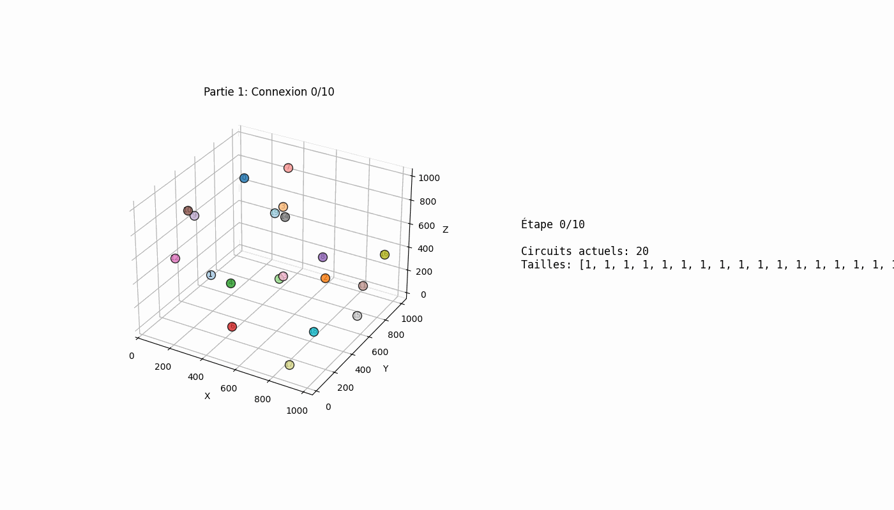
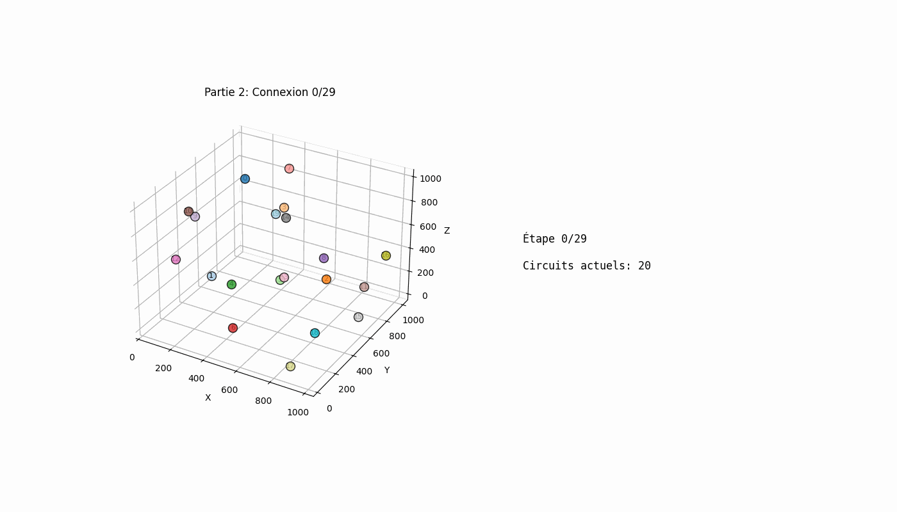

# Day 8: Playground - Advent of Code 2025

## Part 1: Minimum Spanning Tree for 1000 Connections

### Problem

- Elves have junction boxes at 3D positions `(x, y, z)`
- Connect junction boxes to form electrical circuits
- Two connected boxes can share electricity (become part of same circuit)
- Connect the **1000 closest pairs** by Euclidean distance
- Pairs already in the same circuit don't create new connections
- Find the product of the three largest circuit sizes

### Example

```
20 junction boxes
After 10 shortest connections:
- 1 circuit with 5 boxes
- 1 circuit with 4 boxes
- 2 circuits with 2 boxes each
- 7 circuits with 1 box each

Product of three largest: 5 × 4 × 2 = 40
```

### Visualization



*Animation showing the 10 closest connections being added step by step. Each color represents a different circuit. The red line shows the connection being added at each step.*

### Solution - Union-Find (Disjoint Set)

Use Union-Find to efficiently track which boxes belong to the same circuit:

```python
import math
from collections import defaultdict

def distance(p1, p2):
    """Euclidean distance in 3D"""
    return math.sqrt((p1[0]-p2[0])**2 + (p1[1]-p2[1])**2 + (p1[2]-p2[2])**2)

class UnionFind:
    def __init__(self, n):
        self.parent = list(range(n))
        self.rank = [0] * n

    def find(self, x):
        if self.parent[x] != x:
            self.parent[x] = self.find(self.parent[x])  # Path compression
        return self.parent[x]

    def union(self, x, y):
        px, py = self.find(x), self.find(y)
        if px == py:
            return False  # Already connected
        # Union by rank
        if self.rank[px] < self.rank[py]:
            px, py = py, px
        self.parent[py] = px
        if self.rank[px] == self.rank[py]:
            self.rank[px] += 1
        return True

    def get_circuit_sizes(self):
        circuits = defaultdict(int)
        for i in range(len(self.parent)):
            circuits[self.find(i)] += 1
        return sorted(circuits.values(), reverse=True)

def solve_part1(data, num_pairs):
    boxes = parse_input(data)
    n = len(boxes)

    # Calculate all pairwise distances
    distances = []
    for i in range(n):
        for j in range(i + 1, n):
            dist = distance(boxes[i], boxes[j])
            distances.append((dist, i, j))

    distances.sort()

    uf = UnionFind(n)

    # Connect the first num_pairs closest pairs
    for idx in range(num_pairs):
        dist, i, j = distances[idx]
        uf.union(i, j)  # Union even if already connected

    circuit_sizes = uf.get_circuit_sizes()
    return circuit_sizes[0] * circuit_sizes[1] * circuit_sizes[2]
```

**Key insight**: We process the first 1000 pairs **by distance**, not the first 1000 **successful connections**. Some pairs may already be in the same circuit.

### Union-Find Optimizations

1. **Path compression** in `find()`: Make every node point directly to root
2. **Union by rank**: Attach smaller tree under root of larger tree
3. **Time complexity**: Nearly O(1) amortized per operation (inverse Ackermann function)

---

## Part 2: Connecting All Boxes (Full MST)

### Problem

- Continue connecting boxes until **all are in one circuit**
- Find the last pair that completes the single circuit
- Return the product of their X coordinates

### Example

```
Last connection: (216,146,977) and (117,168,530)
Product: 216 × 117 = 25272
```

### Visualization



*Animation showing all connections needed to create a single unified circuit (29 connections total). Watch as separate circuits (different colors) gradually merge into one. The final frame shows the last critical connection.*

### Solution - Continue Until One Component

```python
def solve_part2(data):
    boxes = parse_input(data)
    n = len(boxes)

    # Calculate all pairwise distances
    distances = []
    for i in range(n):
        for j in range(i + 1, n):
            dist = distance(boxes[i], boxes[j])
            distances.append((dist, i, j))

    distances.sort()

    uf = UnionFind(n)

    # Keep connecting until all in one circuit
    last_i, last_j = -1, -1
    for dist, i, j in distances:
        if uf.union(i, j):  # Only count actual new connections
            last_i, last_j = i, j
            # Check if all connected
            circuit_sizes = uf.get_circuit_sizes()
            if len(circuit_sizes) == 1:
                break

    # Multiply X coordinates
    x1 = boxes[last_i][0]
    x2 = boxes[last_j][0]
    return x1 * x2
```

**Key difference**: Now we only count **successful unions** (new connections) and stop when exactly 1 circuit remains.

---

## Connection to Graph Theory: Kruskal's MST Algorithm

This problem is essentially **Kruskal's Minimum Spanning Tree (MST)** algorithm:

### Part 1: Partial MST
- Build MST but stop after exactly 1000 edges
- Count connected component sizes

### Part 2: Complete MST
- Build full MST until all nodes connected
- MST has exactly `n - 1` edges for `n` nodes
- For 1000 boxes: 999 edges needed

### Kruskal's Algorithm Steps
1. Sort all edges by weight (distance)
2. Process edges in order
3. Add edge only if it connects different components (Union-Find)
4. Stop when all nodes connected (or budget exhausted)

### Why Union-Find?
- **Cycle detection**: `find(i) == find(j)` means adding edge creates cycle
- **Component merging**: `union(i, j)` efficiently merges two components
- **Time complexity**: O(E log E) for sorting + O(E α(V)) for Union-Find ≈ O(E log E)

---

## Complexity Analysis

### Time Complexity
- **Distance calculation**: O(n²) for all pairs
- **Sorting**: O(n² log n)
- **Union-Find operations**: O(n² α(n)) ≈ O(n²)
- **Total**: O(n² log n) dominated by sorting

### Space Complexity
- **Distance array**: O(n²)
- **Union-Find**: O(n)
- **Total**: O(n²)

### For n = 1000 boxes:
- Pairs to process: ~500,000
- Sorting: ~9 million comparisons
- Fast enough for modern computers

---

## Answers

- **Part 1**: 122636
- **Part 2**: 9271575747
